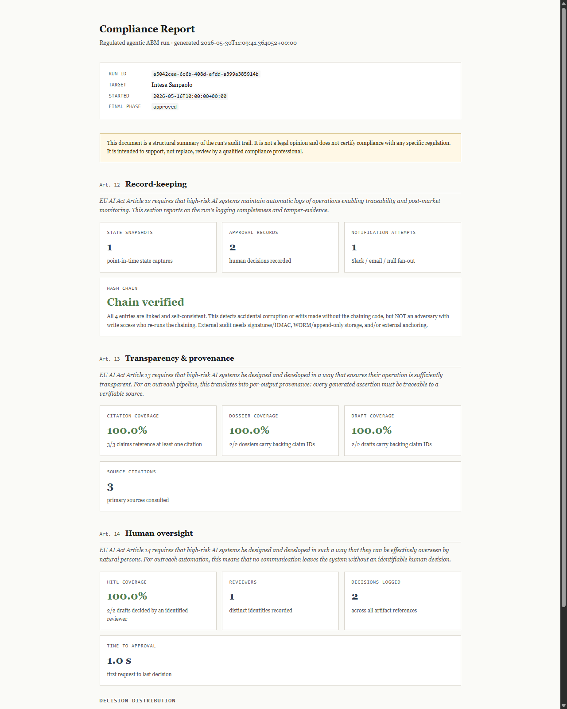

# agentic-audit-reporting

[](https://github.com/errer441122/agentic-audit-reporting/actions/workflows/ci.yml)

Hash-chained audit logging and compliance-report generation for
regulated agentic workflows.

This repository is intentionally scoped to the integrity and reporting
layer. It does not ship the full ABM agent pipeline, reviewer UI,
FastAPI service, source collectors, LLM claim extractor, or notification
adapters. What is present here runs from this archive and is tested.

## What runs here

- `run_store.py` writes run events to JSONL through
  `audit_logger.append_chained()`.
- `audit_logger.py` appends and verifies a SHA-256 hash chain with
  `prev_hash` and `entry_hash` on every line.
- `compliance_report.py` reads a run JSONL and renders a self-contained
  HTML report mapped to EU AI Act Articles 12, 13, and 14.
- `abm_compliance_report.html` is a generated sample report.
- `test_audit_chain.py`, `test_run_store.py`, and
  `test_compliance_report.py` are runnable with only Python and the
  standard library.

The write path is chained. A report generated from `run_store.py` now
shows `Chain verified`, not `Chain not present`.

## Report preview



## Quick start

```bash
python test_audit_chain.py
python test_run_store.py
python test_compliance_report.py
```

Expected result:

```text
All audit-chain assertions passed.
run_store chained-write assertions passed.
compliance_report assertions passed.
```

No third-party package install is required for the shipped tests.
`requirements.txt` is intentionally empty except for comments because
the runtime uses only the Python standard library.
If you already have `pytest`, this also works:

```bash
python -m pytest -q
```

## Minimal usage

```python
from pathlib import Path

from compliance_report import generate_for_run
from run_store import (
    append_approval_record,
    append_notification_attempt,
    artifact_ref_for_draft,
    save_snapshot,
)

store_dir = Path("abm_runs")
run_id = "demo-run-001"

state = {
    "run_id": run_id,
    "target_account": {"legal_name": "Acme S.p.A.", "country": "IT"},
    "supervisor_phase": "approved",
    "started_at": "2026-05-16T10:00:00+00:00",
    "citations": [{"id": "c1"}],
    "claims": [{"id": "k1", "citation_ids": ["c1"]}],
    "dossiers": [{"role": "legal_compliance", "backing_claim_ids": ["k1"]}],
    "outreach_drafts": [
        {"role": "legal_compliance", "backing_claim_ids": ["k1"]},
    ],
}

save_snapshot(store_dir, state)
append_notification_attempt(
    store_dir,
    run_id,
    {
        "kind": "review_requested",
        "channel": "null",
        "outcome": "delivered",
        "attempted_at": "2026-05-16T10:00:01+00:00",
        "run_id": run_id,
    },
)
append_approval_record(
    store_dir,
    run_id,
    {
        "artifact_ref": artifact_ref_for_draft(run_id, "legal_compliance"),
        "decision": "approved",
        "decided_by": "alice@firm.eu",
        "decided_at": "2026-05-16T10:00:02+00:00",
        "rationale": "ok",
    },
)

generate_for_run(
    store_dir / f"{run_id}.jsonl",
    Path("abm_compliance_report.html"),
)
```

Open `abm_compliance_report.html` and the Article 12 hash-chain box
should read `Chain verified`.

To regenerate the committed sample report from the chained write path:

```bash
python scripts/generate_sample_report.py
```

## Audit model

Each JSONL entry is canonicalized and hashed with SHA-256. The first
entry uses a genesis `prev_hash` of 64 zeroes. Every later entry stores
the previous entry's `entry_hash`.

`verify_chain()` detects:

- edits to an existing entry,
- entry deletion or reordering,
- malformed JSON lines,
- legacy/plain JSONL files that have no chain metadata.

Legacy/plain JSONL is reported as `Chain not present`. That is distinct
from `Chain broken`: no tamper evidence exists, but no broken chain is
being claimed either.

## Security scope

This is tamper-evident, not tamper-proof.

The chain catches accidental corruption or edits made without rerunning
the chaining code. It does not stop an actor with full write access from
rewriting the file and recomputing every hash. For external audit use,
add at least one of:

- an HMAC or asymmetric signature whose key is not held by the writer,
- append-only or WORM storage,
- external anchoring of the head hash to an independent witness.

Those hardening layers are intentionally out of scope for this archive.

## Project boundary

This repo does not claim to be a complete agent pipeline. Pipeline
orchestration, UI/API surfaces, source collection, content generation,
and real notification adapters are out of scope here.

Keeping this archive narrow makes the portfolio signal cleaner: clone it,
run the tests, inspect the generated report, and verify the hash chain.
